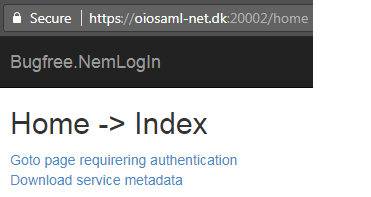
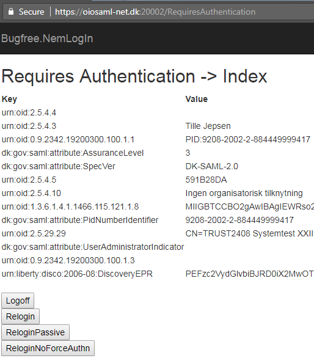

# Bugfree.NemLogIn

This repository consists of an ASP.NET MVC application based on the
oiosaml.net ASP.NET one and a [few notes on asymmetric cryptography
and NemLog-in](). Because NemLog-in utilizes well-known principals,
techniques, and technologies, its documentation assumes knowledge
about those. Without this knowledge, reading the NemLog-in
documentation and debugging issues can be tricky.

Here's a screenshot of navigating to
https://oiosaml-net.dk:20002/RequiresAuthentication within the demo
application and logging in using a test user. The screenshot lists all
SAML assertions returned by the identity provider:





Running this solution, it's assumed that the [.NET SAML2 Service
Provider
Framework](https://svn.softwareborsen.dk/oiosaml.net/trunk/Net%20SAML2%20Service%20Provider%20Framework.docx)
setup has been followed and that the local and remote identity
providers and service provider are operational. Certificates must be
installed and additions made to the hosts file as per the setup
instruction's PowerShell script.

## Checking out oiosaml.net source from Subversion

For easier debugging and the ability to step into the oiosaml.net
code, we prefer using the source distribution over the
[Nuget](https://www.nuget.org/packages/dk.nita.saml20) package.

We can choose between trunk and any of the release tags from the list
below:

    % svn list https://svn.softwareborsen.dk/oiosaml.net/tags
    release-1.6/
    ...
    release-1.7.9/
    release-2.0.0/

    % svn checkout https://svn.softwareborsen.dk/oiosaml.net/tags/release-2.0.0 oiosaml.net-release-2.0.0

Alternatively:

    % svn checkout https://svn.softwareborsen.dk/oiosaml.net/trunk/ oiosaml.net-trunk
    ...

    % cd oiosaml.net-trunk
    % svn info -r HEAD
    Path: trunk
    URL: https://svn.softwareborsen.dk/oiosaml.net/trunk
    Relative URL: ^/oiosaml.net/trunk
    Repository Root: https://svn.softwareborsen.dk
    Repository UUID: 4e58de57-8926-0410-947e-8945c843cdd7
    Revision: 34533
    Node Kind: directory
    Last Changed Author: mollekas
    Last Changed Rev: 34510
    Last Changed Date: 2017-09-18 10:12:14 +0200 (Mon, 18 Sep 2017)

Trunk receives frequent updates. Thus, if we're not on a release tag,
make a note of the "Last Changed Rev" and "Last Changed Date".

## Copying projects from oiosaml.net into Bugfree.NemLogIn.Web

We must copy into our solution from the Subversion checkout the
dk.nita.saml20 and dk.nita.saml20.ext.audit.log4net projects. To make
these projects compile outside the oiosaml.net solution, copy the
content of CommonAssemblyInfo.cs from
src\dk.nita.saml20\CommonAssemblyInfo.cs into the two projects'
AssemblyInfo.cs files.

    // Ronnie Holm: Moved from CommonAssemblyInfo.cs
    [assembly: AssemblyVersion("2.0.0.0")]
    [assembly: AssemblyFileVersion("2.0.0.0")]
    [assembly: AssemblyInformationalVersion("2.0.0.0")]

Finally, Bugfree.NemLogIn.Web must be setup to reference the
dk.nita.saml20 and dk.nita.saml20.ext.audit.log4net projects.

## Setting up Bugfree.NemLogIn.Web to use oiosaml.net

The following supplements the steps from [.NET SAML2 Service Provider
Framework](https://svn.softwareborsen.dk/oiosaml.net/trunk/Net%20SAML2%20Service%20Provider%20Framework.docx),
Section 6.1.

  1. Copy the IdP-metadata files from
     oiosaml.net\src\dk.nita.saml20\WebsiteDemo\idp-metadata into
     \src\Bugfree.NemLogIn.Web\IdP-metadata.

  2. To test against the NemLog-in test IdP, the IP at which the
     service provider is run must be whitelisted with Nets'
     certificate revocation list server. Otherwise, login with the IdP
     will succeed but once the result is posted back to the service
     provider, the certificate used to sign the IdP response cannot be
     verified, causing an exception. Testing from a non-whitelisted
     IP, we disable verifying certification chain trust. We can do so
     by editing Web.config:

     ```
     <IDPEndPoints metadata="IdP-metadata">
         <add id="https://saml.test-nemlog-in.dk/" omitAssertionSignatureCheck="true" />
     </IDPEndPoints>
     ```
	 
  3. The MVC app must be accessible at https://oiosaml-net.dk:20002
     for the login process to succeed (since the service provider uses
     the oiosaml.net demo provider's metadata). Even though
     oiosaml-net.dk is mapped to 127.0.0.1, IISExpress doesn't respond
     to requests from oiosaml-net.dk. Opening this URL will result in
     browser message of:

     ```
     Bad Request - Invalid Hostname
     HTTP Error 400. The request hostname is invalid.
     ```

     With Visual Studio, the IISExpress config file is dynamically
     generated each time the project is loaded. It's stored in
     src\.vs\config\applicationhost.config. To make IISExpress respond
     to oiosaml.net requests, open this file and look for the line
     below:

     ```
     <binding protocol="https" bindingInformation="*:20002:localhost" />
     ```

     It should be substituted by
 
     ```
     <binding protocol="https" bindingInformation="*:20002:*" />
     ```

   for IISExpress to respond to any address on port 20002 and not just
   https://localhost:20002.

## Develop locally by dependency-injecting NemLog-in into controllers

During development of a service provider, continuously logging into
NemLog-in is a hassle. Instead, use the local identity provider or
dependency-inject an object encapsulating the SamlIdentity into the
controller. This way, any property otherwise returned by NemLog-in can
be changed in seconds.

## Updating the metadata file for a new service provider

For easy setup, Bugfree.NemLogIn shares its metadata with the
oiosaml.net demo service. If we were to create a new service, hosted
at a different URL and using different certificates for encryption and
signing, the service's metadata requires modification.

Metadata is updated by making changes to the XML file directly
(download through the metadata.ashx endpoint). After modification, the
file must be uploaded to the (NemLog-in administration
portal)[https://administration.nemlog-in.dk]. Everyone with an
employee NemID can be granted access to modifying the configuration of
a NemLog-in application within the portal by a company administrator. 

  1. Inside the EntityDescriptor element, update the entityID
     attribute to match a new environment. While the string looks like
     a URL, it doesn't have to be a valid URL. The convention is to
     prepend "saml" and the type of environment to the service's
     URL. For a test environment, the URL would be
     https://saml.test.myservice.dk and for prod it would be
     https://saml.myservice.dk.

  2. Update the two SingleLogoutService elements by changing the
     Location and ResponseLocation attribute to match the base URL of
     the service. Then append logout.ashx, e.g.,
     https://myservice/logout.ashx.

  3. Update the AssertionConsumerService element's Location attribute
     to match the base URL of your service. Then append login.ashx,
     e.g., https://myservice/login.ashx.

  4. Inside the two X509Certificate elements, paste in the public key
     of the service's certificate. In principle, separate public keys
     could be used, but in practice using the same key seems common
     practice.

  5. Update the ContactPerson child elements with relevant information
     for the service.

## Updating the Web.config file for a new service provider

The Web.config file contains a few environment specific settings to
match up with the service's metadata:

  1. The SigningCertificate element's findValue attribute must be
     updated with the thumbprint of service's certificate. The private
     key installed in the certificate store is what's used for
     signing.

  2. The inner text of the Audience element must match what's present
     in the service's metadata, i.e., the entityId value. This value
     is sent to the IdP and is how the identity provider identifies
     the service provider calling it.

## Debugging on server without Visual Studio

In a production environment with no Visual Studio, zero footprint
tools such as [dnspy](https://github.com/0xd4d/dnSpy) or
[WinDbg](https://developer.microsoft.com/en-us/windows/hardware/download-windbg)
can be used for tracing code executing. dnspy disassembles IL to C#
and supports setting breaking and inspecting the value of variables in
C# code without access to the original sources. WinDbg on the other
hand works solely at the IL level. Using these tools, it's possible to
follow execution through the service provider's own code as well as
that of the oiosaml.net component.

## Known issues

### oiosaml.net setup script only supported by Windows 7+

While not explicitly stated, the oiosaml.net install script assumes a
recent Windows version. On Windows 7, the following changes are
required to install certificates.

Running $PSVersionTable on Windows 7 might report something like this:

    % $PSVersionTable

    Name                           Value
    ----                           -----
    CLRVersion                     2.0.50727.8762
    BuildVersion                   6.1.7601.17514
    PSVersion                      2.0
    WSManStackVersion              2.0
    PSCompatibleVersions           {1.0, 2.0}
    SerializationVersion           1.1.0.1
    PSRemotingProtocolVersion      2.1

To upgrade PowerShell to a more recent version see [Installing Windows
PowerShell](https://docs.microsoft.com/en-us/powershell/scripting/setup/installing-windows-powershell?view=powershell-5.1). Version
5.1 appears the most recent version for Windows 7.

With PowerShell 2.0, the $PSScriptRoot variable in
oiosaml.net\setup\setup_prerequisites.ps1 is null, causing a runtime
script failure.

After installing, here's the new output:

    % $PSVersionTable

    Name                           Value
    ----                           -----
    PSVersion                      5.1.14409.1005
    PSEdition                      Desktop
    PSCompatibleVersions           {1.0, 2.0, 3.0, 4.0...}
    BuildVersion                   10.0.14409.1005
    CLRVersion                     4.0.30319.42000
    WSManStackVersion              3.0
    PSRemotingProtocolVersion      2.3
    SerializationVersion           1.1.0.1

Now the $PSScriptRoot of the installation script is now an empty
string rather than null.

### Import-PfxCertificate cmdlet not available for Windows 7

The Import-PfxCertificate cmdlet from
oiosaml.net/setup_prerequisites.ps1 isn't available for Windows 7,
causing a script failure on the following lines:

    Import-PfxCertificate '..\certificates\demoidp ssl.pfx' -Password $certpassword -CertStoreLocation Cert:\LocalMachine\My
    Import-PfxCertificate '..\certificates\demoidp ssl.pfx' -Password $certpassword -CertStoreLocation Cert:\LocalMachine\TrustedPeople

Instead we can use this PowerShell helper function utilizing the .NET
API.

    function Import-PfxCertificate {
        param([String]$certPath,[String]$certRootStore = "localmachine", [String]$certStore = "My", $pfxPass = $null)
        $pfx = New-Object System.Security.Cryptography.X509Certificates.X509Certificate2

        if ($pfxPass -eq $null) {
          $pfxPass = read-host "Password" -assecurestring
        } 

        $pfx.import($certPath, $pfxPass, "Exportable,PersistKeySet")

        $store = New-Object System.Security.Cryptography.X509Certificates.X509Store($certStore,$certRootStore)
        $store.open("MaxAllowed") 
        $store.add($pfx) 
        $store.close()
      }
    
Then we must specify the full path to certificate for the function
work:

      Import-PfxCertificate 'oiosaml.net\certificates\demoidp ssl.pfx' LocalMachine My "test1234"
      Import-PfxCertificate 'oiosaml.net\certificates\demoidp ssl.pfx' LocalMachine TrustedPeople "test1234"

### Page shows "Saml20Indentity not initialized" error message

The application has lost track that the user is logged in. If we
logout by navigating to https://oiosaml-net.dk:20002/logout.ashx and
then go back to a page which requires authentication, oiosaml.net
redirects the browser to the NemLog-in IdP which might see us as
logged in, redirecting the browser back to the original page without
the need for explicitly logging in again (it's unclear if this error
message is a feature or a bug).

## References

[Youtube: Introduction to SAML - Introduction to SAML - Chalktalk on
what is it, how it is
used](https://www.youtube.com/watch?v=S9BpeOmuEz4&list=PLSEDryV9VNWHYtyWrFc_TpMYRwemphDTS)

[.NET SAML2 Service Provider
Framework](https://svn.softwareborsen.dk/oiosaml.net/trunk/Net%20SAML2%20Service%20Provider%20Framework.docx)

## Contact

Drop me a line at mail@bugfree.dk if you require assistance with
integrating NemLog-in in your application.